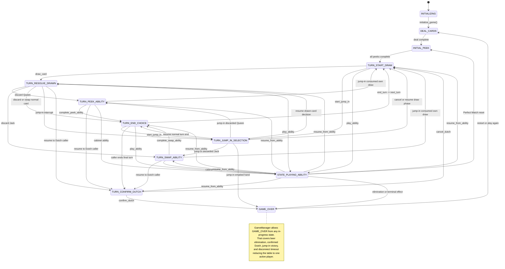
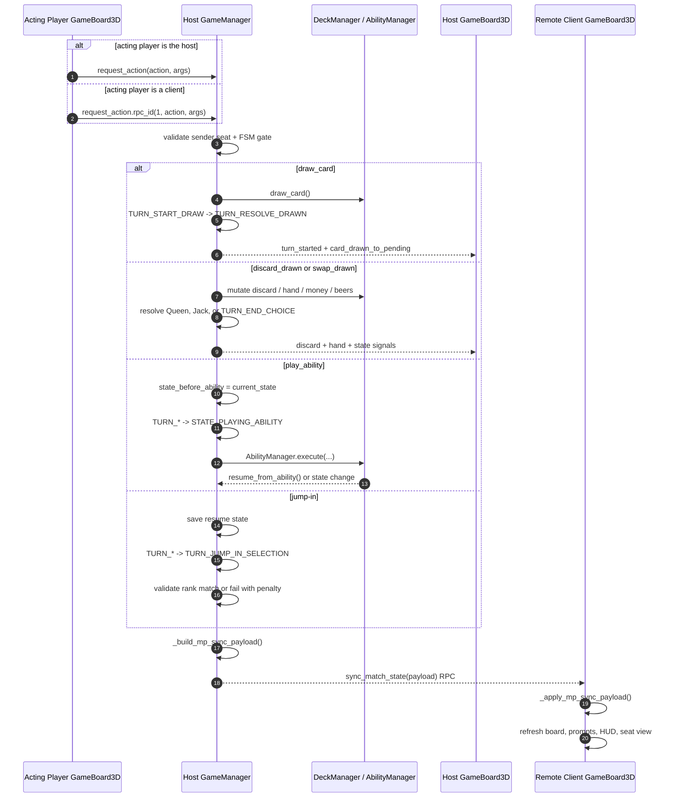
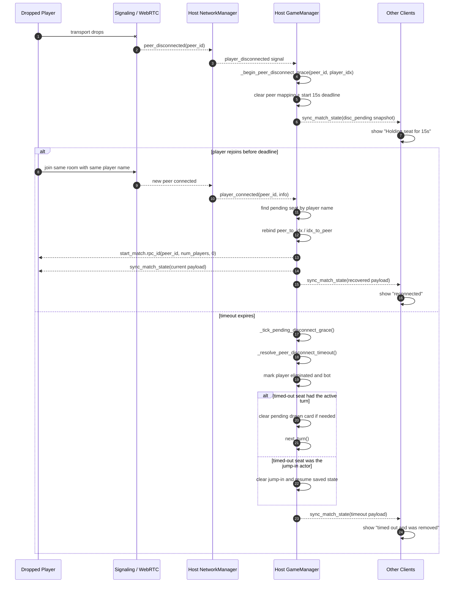
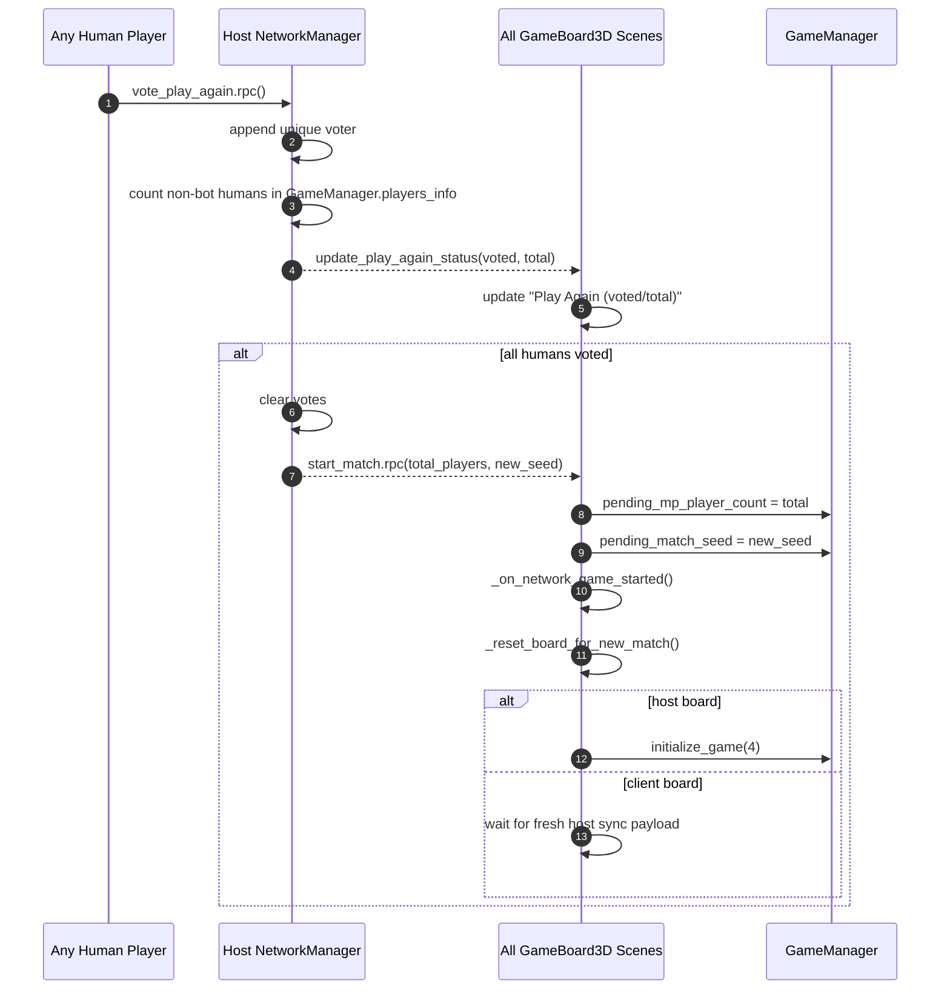
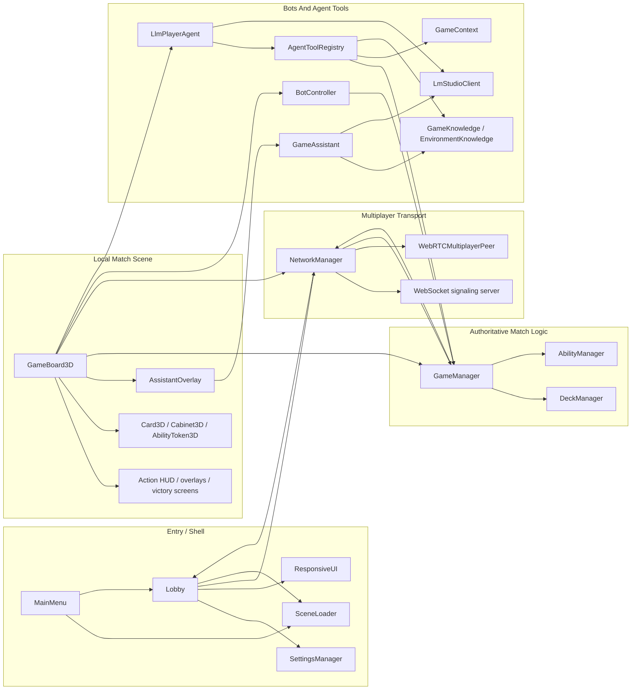
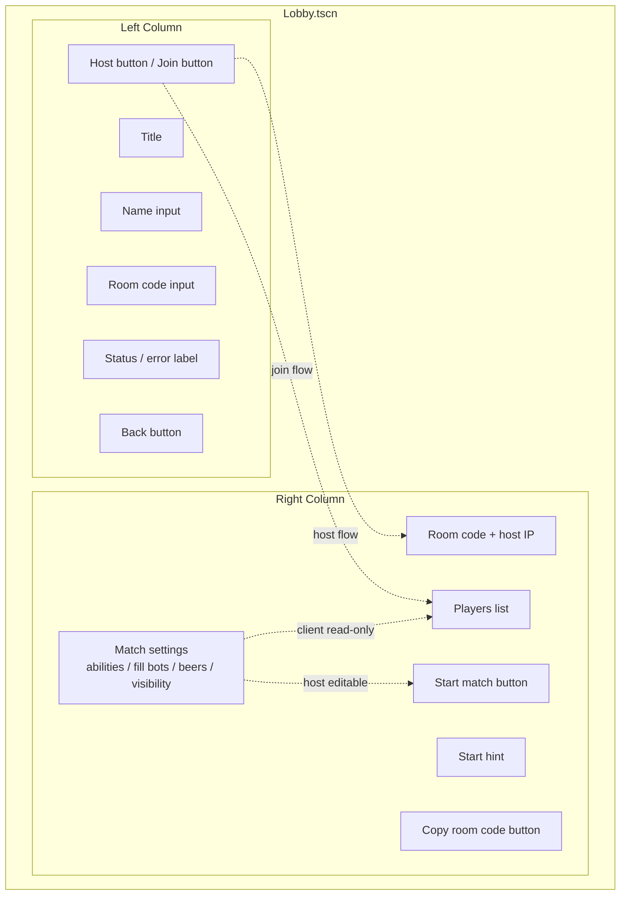
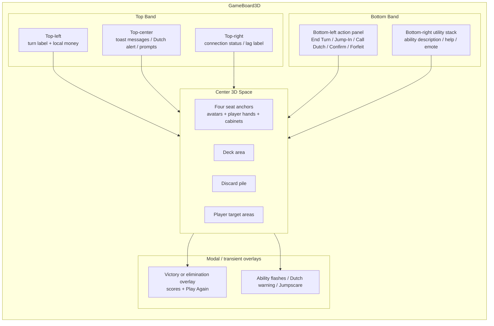
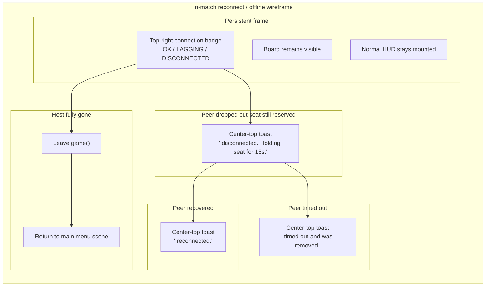

# Design & Architecture

This document is Mermaid-first on purpose. Every fenced `mermaid` block below is intended to paste directly into `mermaid.live` without conversion.

## Full Match FSM

`CHECK_DUTCH` still exists in the enum, but the live transition code currently routes straight into `TURN_CONFIRM_DUTCH`.

## Multiplayer Sequences

### Host-Authoritative Player Action And Sync

### Disconnect Grace, Reconnect, And Timeout

### Play-Again Vote And Rematch Bootstrap

## Component Ownership

## Rule Interaction Matrix

### Core Special Cards And Turn-Flow Rules

```mermaid
flowchart TB
    subgraph Queen["Queen"]
        direction LR
        Q1["Trigger<br/>Discard Queen from draw or jump-in"] --> Q2["FSM<br/>TURN_RESOLVE_DRAWN or TURN_JUMP_IN_SELECTION -> TURN_PEEK_ABILITY"] --> Q3["Actor<br/>active_ability_player"] --> Q4["Effect<br/>Reveal any one face-down card"] --> Q5["Exit<br/>complete_peek_ability -> TURN_END_CHOICE, TURN_CONFIRM_DUTCH, or TURN_START_DRAW"]
    end

    subgraph Jack["Jack"]
        direction LR
        J1["Trigger<br/>Discard Jack from draw or jump-in"] --> J2["FSM<br/>TURN_RESOLVE_DRAWN or TURN_JUMP_IN_SELECTION -> TURN_SWAP_ABILITY"] --> J3["Actor<br/>active_ability_player"] --> J4["Effect<br/>Blindly swap any two valid hand slots"] --> J5["Exit<br/>complete_swap_ability -> TURN_END_CHOICE, TURN_CONFIRM_DUTCH, or TURN_START_DRAW"]
    end

    subgraph KingOfDiamonds["King Of Diamonds"]
        direction LR
        K1["Trigger<br/>Card exists in a hand or gets scored"] --> K2["Scoring rule<br/>point value is 0 instead of 13"] --> K3["Economy rule<br/>discarding it pays the top money tier"] --> K4["FSM<br/>no special state transition by itself"]
    end

    subgraph JumpIn["Jump-In"]
        direction LR
        I1["Trigger<br/>Any player sees matching discard rank"] --> I2["FSM<br/>interrupt into TURN_JUMP_IN_SELECTION"] --> I3["Validation<br/>selected rank must equal top discard rank"]
        I3 --> I4["Success<br/>remove card, discard it, gain money"]
        I3 --> I5["Failure<br/>drink beer, then draw penalty card after delay"]
        I4 --> I6["Exit<br/>resume saved state or GAME_OVER if hand emptied"]
        I5 --> I6
    end

    subgraph Dutch["Dutch"]
        direction LR
        D1["Trigger<br/>Current player presses Call Dutch in TURN_END_CHOICE"] --> D2["Effect<br/>set dutch_caller_index and pass turn"] --> D3["Table rule<br/>everyone gets one last normal turn"] --> D4["Caller re-enters TURN_CONFIRM_DUTCH after their final turn"] --> D5["Exit<br/>confirm -> GAME_OVER | forfeit -> TURN_START_DRAW and lose right to call again"]
    end
```

### Cabinet Ability Matrix

```mermaid
flowchart TB
    subgraph AbilityEnvelope["Shared Ability Envelope"]
        direction LR
        A0["Valid entry states<br/>TURN_START_DRAW, TURN_RESOLVE_DRAWN, TURN_END_CHOICE, TURN_PEEK_ABILITY, TURN_SWAP_ABILITY"] --> A1["play_ability()"] --> A2["FSM<br/>STATE_PLAYING_ABILITY"] --> A3["AbilityManager.execute(...)"] --> A4["Default exit<br/>resume_from_ability() back to saved state"]
    end

    subgraph PressureAndTempo["Pressure And Tempo"]
        direction TB
        BU1["Bottoms Up"] --> BU2["Target<br/>one player"] --> BU3["Effect<br/>target drinks 1 beer"]
        RF1["Refuel"] --> RF2["Target<br/>self"] --> RF3["Effect<br/>+1 beer, capped at 3"]
        SK1["Skip"] --> SK2["Target<br/>one player"] --> SK3["Effect<br/>target loses next turn"]
        RV1["Reverse"] --> RV2["Target<br/>table"] --> RV3["Effect<br/>flip turn_direction"]
    end

    subgraph HandAndDeckControl["Hand And Deck Control"]
        direction TB
        TR1["Trim Off"] --> TR2["Target<br/>self"] --> TR3["Effect<br/>discard highest-value known card"]
        BO1["Boulder"] --> BO2["Target<br/>one player"] --> BO3["Effect<br/>target receives highest-value card still in deck"]
        JS1["Jumpscare"] --> JS2["Target<br/>one player"] --> JS3["Effect<br/>target gains one drawn card"]
        SH1["Shuffle"] --> SH2["Target<br/>one player"] --> SH3["Effect<br/>randomize target hand order"]
    end

    subgraph ScoringControl["Scoring Control"]
        direction TB
        IN1["Inflation"] --> IN2["Target<br/>one player"] --> IN3["Effect<br/>target hand point modifiers x2"]
        HO1["Half Off"] --> HO2["Target<br/>one player"] --> HO3["Effect<br/>target hand point modifiers x0.5"]
        PS1["Polarity Shift"] --> PS2["Target<br/>table"] --> PS3["Effect<br/>toggle lowest-wins vs highest-wins"]
    end

    subgraph RoundReset["Round Reset"]
        direction TB
        PM1["Perfect Match"] --> PM2["Target<br/>whole round"] --> PM3["Effect<br/>collect all cards, reshuffle, give activator Ace+2+3+4, redeal others, restart INITIAL_PEEK"]
    end
```

## Wireframes

### Lobby Screen

### In-Match HUD And 3D Board

### Reconnect And Offline UX

