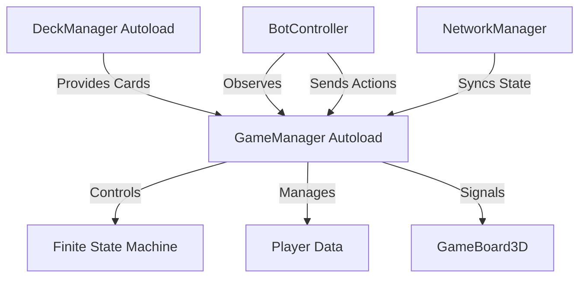
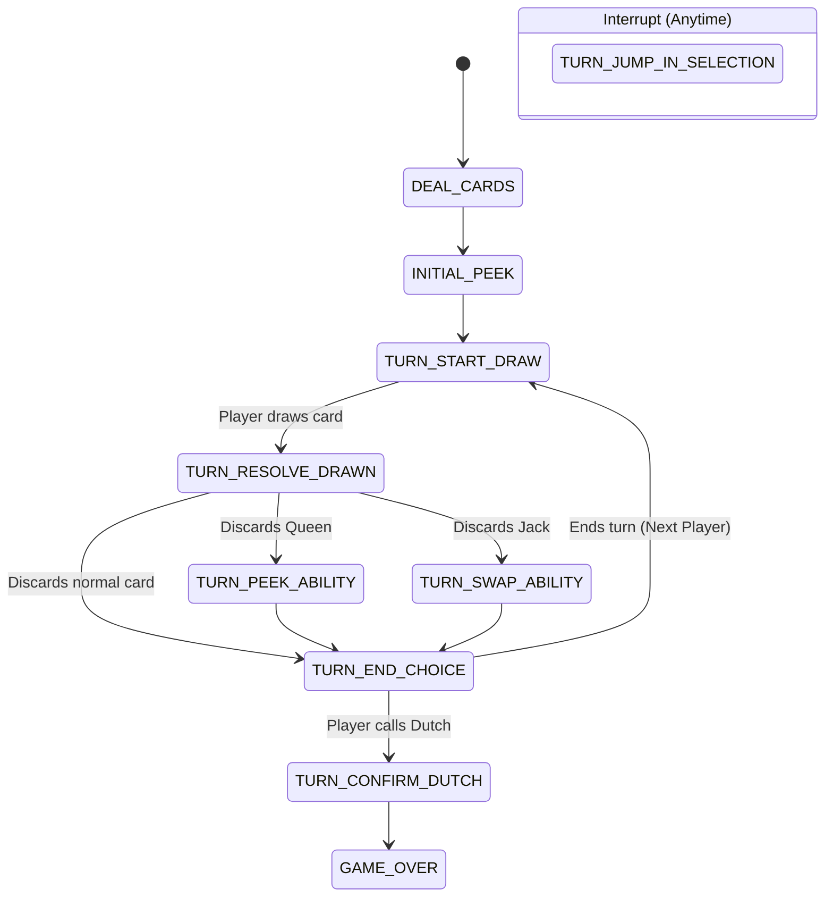

# Design & Architecture

This document tracks the technical state of the Dutch card game, including the Finite State Machine (FSM), manager responsibilities, and scene hierarchy.

## 🏗️ Core Architecture

- **GameManager (Autoload)**: Owns the FSM and overall game flow. All state transitions happen here.
- **DeckManager (Autoload)**: Manages the deck and discard pile. Handles card creation and randomization.
- **EconomyManager (Pending)**: Will handle money, beer consumption, and ability purchases.
- **BotController**: Attaches to the game board at runtime to process bot turns and memory.

## 🔄 Finite State Machine (FSM)

Current States:
- `DEAL_CARDS`: Initial card distribution (4 cards per player).
- `INITIAL_PEEK`: Player selects 2 cards to see briefly.
- `TURN_START_DRAW`: Player draws from the deck.
- `TURN_RESOLVE_DRAWN`: Player decides to swap or discard the drawn card.
- `TURN_PEEK_ABILITY`: (Queen discarded) Reveal any card for 3s.
- `TURN_SWAP_ABILITY`: (Jack discarded) Swap any two cards on the board.
- `TURN_JUMP_IN_SELECTION`: Player is picking a card to match the pile.
- `TURN_CONFIRM_DUTCH`: The Dutch caller's final confirmation or forfeit.
- `TURN_END_CHOICE`: Player choices at end of turn (End, Jump, Call Dutch).
- `GAME_OVER`: Scoring, results UI, and potential restart.

## 🃏 Card Data & Nodes
- **CardData (Resource)**: Stores rank, suit, and `is_face_up` visibility.
- **Card (Scene)**: Handles 3D/2D visual state, flip animations, and hover effects.

## 📋 Scenes
- `main_menu.tscn`: Game entry point.
- `game_board.tscn`: Main gameplay arena. Supports up to 4 players.
- `settings_menu.tscn`: Audio (Music/SFX) and Resolution settings.
- `pause_menu.tscn`: CanvasLayer overlay for match suspension.

## ⌨️ Debugging
- **Reveal All**: Press `L` to toggle visibility of all cards (visual only, doesn't change `CardData`).
- **Dev Console**: Integrated console for state manipulation and testing.
