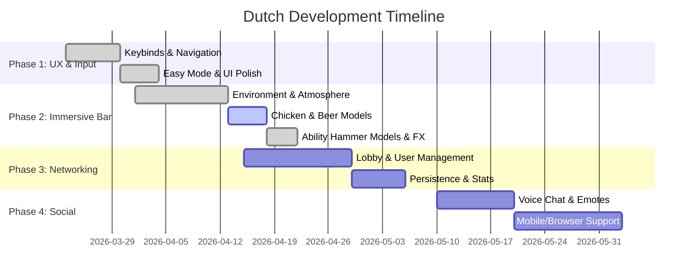

# 🇳🇱 Dutch: Strategic Roadmap

This roadmap defines the transition of Dutch from its current prototype to a polished, immersive multiplayer experience. It includes all essential features for gameplay, visuals, and persistence.

## 📊 Visual Roadmap (Gantt)

---

## 📅 PHASE 1: UX, Input & Optimization
*Goal: Solidify the gameplay feel and reach technical parity.*

### 🛠️ Tasks
1.  **Standardized Keybinds**:
    - [x] `Space` (Jump-In), `Enter` (End Turn), `D` (Call Dutch), `C` (Confirm Dutch), `F` (Forfeit Dutch).
    - [x] Numeric keys or arrow-based card selection.
2.  **Easy Mode**:
    - [x] Accessibility toggle to keep player cards face-up at all times.
3.  **UI/Scene Optimization**:
    - [x] Rework 3D view angle for optimal board visibility.
    - [x] Reduce UI saturation and "bloat" for a premium, clean aesthetic.
4.  **Sound Design**:
    - [/] High-fidelity foley for card moves and environment sounds.

---

## 🎨 PHASE 2: The "Run-Down Bar" Rework
*Goal: Create an immersive, thematic environment.*

### 🛠️ Tasks
1.  **Atmosphere & Scene**:
    - [x] Complete rework of the surroundings into a "Run-down Bar".
    - [x] Thematic table and chairs.
2.  **Interactive 3D Models**:
    - [x] **The Chicken**: Animated model that reacts to purchases.
    - [x] **Beers**: 3D rendered mugs (3 per player) that disappear upon consumption.
3.  **Visual Polish**:
    - [x] Custom models and FX for all Ability Hammers.
    - [x] Enhanced animations for drawing, swapping, and ability execution.

---

## 🌐 PHASE 3: Networking & Progression
*Goal: Connectivity and persistent data.*

### 🛠️ Tasks
1.  **Multiplayer Networking**:
    - [X] Player Identity: Picking and displaying a Username.
2.  **Progression & Saving**:
    - [x] **Persistent Settings**: Save Volume, Resolution, and Keybinds.
    - [x] **Player Stats**: Save "Matches Won" to player profiles to show off skill.

---

## 🚀 PHASE 4: Social & Accessibility
*Goal: Finalize the social layer and target platforms.*

### 🛠️ Tasks
1.  **Social Layer**:
    - [x] **Player Models**: 3D avatars seated at the table.
    - [ ] **Voice Chat**: Spatial interaction in the bar.
    - [x] **Emotes**: Triggerable animations for when a player wins.
2.  **Platform Reach**:
    - [x] Complete Browser (WebAssembly) and Mobile (Android/iOS) UI adaptive support.

---

## 🧑‍💼 Project Manager's Desk (Assignment Log)

| Task ID | Component | Description | Assignee | Status |
| :--- | :--- | :--- | :--- | :--- |
| PM-001 | Docs | Logic & Roadmap Correction | Antigravity | [COMPLETED] |
| VIS-001 | Env | Immersive Bar Rework | [UNASSIGNED] | [BACKLOG] |
| NET-001 | Sync | Multiplayer Lobby System | [UNASSIGNED] | [BACKLOG] |
| SYS-002 | Save | Persistence: Settings/Stats | [UNASSIGNED] | [BACKLOG] |
