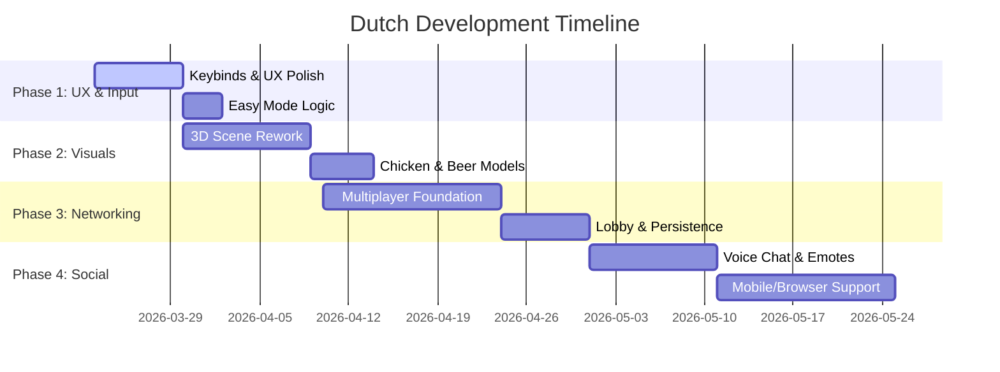

# 🇳🇱 Dutch: Strategic Roadmap

This roadmap defines the transition of Dutch from its current prototype to a polished, multiplayer-ready experience. Tasks are ordered logically to minimize clashing and ensure a steady merge flow.

## 📊 Visual Roadmap (Gantt)

---

## 📅 PHASE 1: UX, Input & Optimization (Immediate)
*Goal: Make the game playable and comfortable for all users.*

### 🛠️ Tasks
1.  **Keybinds**: Standardize keyboard controls for efficiency.
    - [ ] `Space` (Jump-In), `Enter` (End Turn), `D` (Call Dutch), `C` (Confirm Dutch), `F` (Forfeit Dutch).
2.  **Easy Mode**:
    - [ ] Toggle to keep player cards face-up at all times (Accessibility).
3.  **Optimization**:
    - [ ] Rework view angle for better board coverage.
    - [ ] Reduce UI saturation/bloat (cleaner headers and buttons).
4.  **Persistence (Settings)**:
    - [ ] Save Volume, Resolution, and Keybinds to `user://` config file.

---

## 🎨 PHASE 2: Visual & Audio Overhaul
*Goal: Replace prototypes with high-quality thematic assets.*

### 🛠️ Tasks
1.  **Scene Rework**: Replace table/background with a "Run-down Bar" environment.
    - [ ] 3D Model: The Chicken (animated legs for interaction).
    - [ ] 3D Models: Realistic Beer mugs (3 per player).
2.  **Animations & Sound**:
    - [ ] Better animations for pulling cards and using abilities.
    - [ ] Procedural sound effects for card flipping/drawing.

---

## 🌐 PHASE 3: Multiplayer & Connectivity
*Goal: Transition from Local/Bot play to Online matches.*

### 🛠️ Tasks
1.  **Networking**:
    - [ ] Host/Join logic via Godot Multiplayer API.
    - [ ] Lobby list (Join a room from a list of active rooms).
    - [ ] Picking a persistent Username.
2.  **Progress Tracking**:
    - [ ] Save "Matches Won" to player stats for "Enemy Flexing".

---

## 🚀 PHASE 4: Social & Platforms
*Goal: Community features and final release.*

### 🛠️ Tasks
1.  **Player Expression**:
    - [ ] Character Models (seated at the table).
    - [ ] Player Emotes (Winning/Losing animations).
    - [ ] Spatial Voice Chat.
2.  **Platform Support**:
    - [ ] Adaptive UI for Browser (WebAssembly) and Mobile (Android/iOS).

---

## 🧑‍💼 Project Manager's Desk (Assignment Log)
*Programmers and AI agents should check this section for their active assignments.*

| Task ID | Component | Description | Assignee | Status |
| :--- | :--- | :--- | :--- | :--- |
| PM-001 | Docs | Rules & Roadmap Correction | Antigravity | [COMPLETED] |
| SYS-002 | Logic | Keybinds Foundation | [UNASSIGNED] | [BACKLOG] |
| VIS-001 | Assets | 3D Model: The Chicken | [UNASSIGNED] | [BACKLOG] |

---

> [!TIP]
> **To create your own visual chart**: I have included a **Mermaid.js** chart at the top. You can edit this directly in GitHub/VS Code to update the dates and status. For a more "infographic" look, I recommend using **Canva** or **Miro** with a "Product Roadmap" template.
